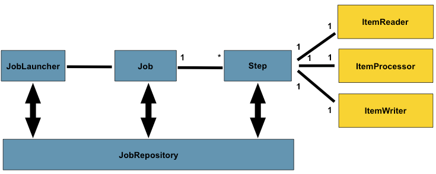
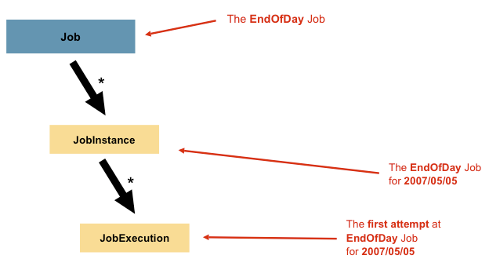
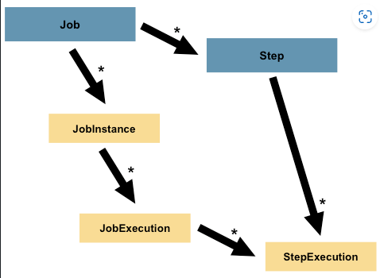

## Spring Batch Processing

Spring batch processing is a technique which processes data in a large group instead of a single element of data. Where you can process a high volume of data with minimal human interaction.

### Job

A Job is an entity that encapsulates an entire batch process.

### Step

A Step is a domain object that encapsulates an independent, sequential phase of a batch job. Every job is composed entirely of one or more steps.

### JobRepository

JobRepository is the persistence mechanism for all the stereotypes mentioned earlier. It provides CRUD operations for `JobLauncher`, `Job` and `Step` implementations.

### ItemReader

ItemReader is an abstraction that represents the retrieval of input for a `Step`.

### ItemWriter

ItemWriter is an abstraction that represents the output of a `Step`.

### ItemProcessor

ItemProcessor is an abstraction that represents the business processing of an item.